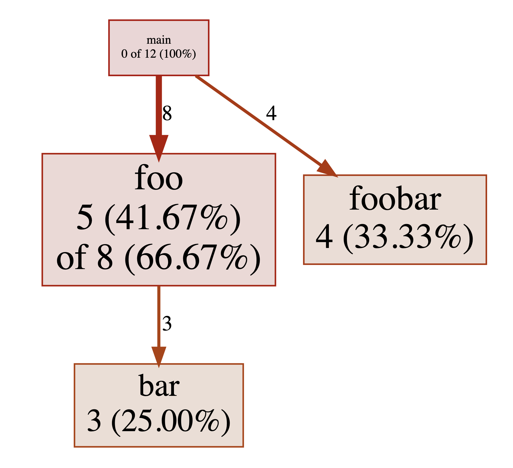

[](https://pkg.go.dev/github.com/felixge/pprofutils)
[](https://github.com/felixge/pprofutils/actions/workflows/go.yml?query=branch%3Amain)

# pprofutils

pprofutils is a swiss army knife for [pprof files](https://github.com/DataDog/go-profiler-notes/blob/main/pprof.md). You can use it as a command line utility or as a free web service.

- [**Install**](#install)
- [**Utilities**](#utilities):  · [json](#json) · [raw](#raw) · [folded](#folded) · [labelframes](#labelframes)
- [**License**](#license)

## Install

pprofutils requires Go 1.16 and can be installed like this:

```
go install github.com/felixge/pprofutils/cmd/pprofutils@latest
```

Alternatively you can use it as a free web service hosted at https://pprof.to.

## Utilities

### json

Converts from pprof to json and vice vera. The input format is automatically
	detected and used to determine the output format.

The input and output file default to "-" which means stdin or stdout.

##### Use json utility via cli

```
pprofutils json <input file> <output file>
```

##### Use json utility via web service

```
curl --data-binary @<input file> pprof.to/json > <output file>
```

##### Example 1: Convert pprof to json
```shell
pprofutils json examples/json.in.pprof examples/json.out.json
# or
curl --data-binary @examples/json.in.pprof pprof.to/json > examples/json.out.json
```
See [examples/json.in.pprof](./examples/json.in.pprof) and [examples/json.out.json](./examples/json.out.json) for more details.
##### Example 2: Convert json to pprof
```shell
pprofutils json examples/json.in.json examples/json.out.pprof
# or
curl --data-binary @examples/json.in.json pprof.to/json > examples/json.out.pprof
```
See [examples/json.in.json](./examples/json.in.json) and [examples/json.out.pprof](./examples/json.out.pprof) for more details.


### raw

Converts pprof to the same text format as go tool pprof -raw.

The input and output file default to "-" which means stdin or stdout.

##### Use raw utility via cli

```
pprofutils raw <input file> <output file>
```

##### Use raw utility via web service

```
curl --data-binary @<input file> pprof.to/raw > <output file>
```

##### Example 1: Convert pprof to raw
```shell
pprofutils raw examples/raw.in.pprof examples/raw.out.txt
# or
curl --data-binary @examples/raw.in.pprof pprof.to/raw > examples/raw.out.txt
```
See [examples/raw.in.pprof](./examples/raw.in.pprof) and [examples/raw.out.txt](./examples/raw.out.txt) for more details.


### folded

Converts pprof to Brendan Gregg's folded text format and vice versa. The input
format is automatically detected and used to determine the output format.

The input and output file default to "-" which means stdin or stdout.

##### Use folded utility via cli

```
pprofutils folded [-headers] <input file> <output file>

FLAGS:
  -headers=false Add header column for each sample type
```

##### Use folded utility via web service

```
curl --data-binary @<input file> pprof.to/folded?headers=false > <output file>
```

##### Example 1: Convert folded text to pprof
```shell
pprofutils folded examples/folded.in.txt examples/folded.out.pprof
# or
curl --data-binary @examples/folded.in.txt pprof.to/folded > examples/folded.out.pprof
```
Converts [examples/folded.in.txt](./examples/folded.in.txt) with the following content:

```
main;foo 5
main;foo;bar 3
main;foobar 4
```

Into a new profile [examples/folded.out.pprof](./examples/folded.out.pprof) that looks like this:


##### Example 2: Convert pprof to folded text
```shell
pprofutils folded examples/folded.in.pprof examples/folded.out.txt
# or
curl --data-binary @examples/folded.in.pprof pprof.to/folded > examples/folded.out.txt
```
Converts the profile [examples/folded.in.pprof](./examples/folded.in.pprof) that looks like this:


Into a new folded text file [examples/folded.out.txt](./examples/folded.out.txt) that looks like this:

```
main;foo 5
main;foobar 4
main;foo;bar 3

```


### labelframes

Adds virtual root frames for the each value of the selected pprof label. This
is useful to visualize label values in a flamegraph.

The input and output file default to "-" which means stdin or stdout.

##### Use labelframes utility via cli

```
pprofutils labelframes -label=<label> <input file> <output file>

FLAGS:
  -label=mylabel The label key to turn into virtual frames.
```

##### Use labelframes utility via web service

```
curl --data-binary @<input file> pprof.to/labelframes?label=mylabel > <output file>
```

##### Example 1: Add root frames for pprof label values
```shell
pprofutils labelframes examples/labelframes.in.pprof examples/labelframes.out.pprof
# or
curl --data-binary @examples/labelframes.in.pprof pprof.to/labelframes > examples/labelframes.out.pprof
```
Converts the profile [examples/labelframes.in.pprof](./examples/labelframes.in.pprof) that looks like this:


Into a new profile [examples/labelframes.out.pprof](./examples/labelframes.out.pprof) that looks like this:


## Usage

Convert a pprof file to folded stack text:

```bash
pprof2text < ./test-fixtures/pprof.samples.cpu.001.pb.gz > example.txt
```

Convert a folded stack text file to pprof:

```bash
text2pprof < example.txt > example.pprof
```

Warning: Converting from pprof to text is lossy. Only the first sample type will be converted, file names, lines, labels, and more will be dropped. Patches to make things less lossy would be welcome, but please open an issue first to discuss.

Convert a Linux `perf.data` profile to `pprof`, via Brendan Gregg's [`stackcollapse-perf.pl`](https://github.com/brendangregg/FlameGraph/blob/master/stackcollapse-perf.pl) script:

```bash
perf script | stackcollapse-perf.pl | text2pprof > perf.pprof
```

Create a delta profile that contains the difference `heap-b.pprof - heap-a.pprof`:

```bash
pprofdelta -o delta.pprof heap-a.pprof heap-b.pprof
```

## Tutorial: Generate a fake pprof profile

My primary use case for this tool is to quickly generate fake pprof profiles for creating educational content.

This can be done by simply creating a file called `profile.txt` with the following content:

```
main;foo 5
main;foo;bar 3
main;foobar 4
```

Then convert it to a pprof profile:

```bash
text2pprof < profile.txt > profile.pprof
```

And finally view it using pprof:

```bash
go tool pprof -http=:6060 profile.pprof
```

The resulting graphs should look like this:




## Custom Extension: Multiple Sample Types

The `text2pprof` command supports a custom extension to the folded text format that allows users to specify multiple sample types.

This is done via a header that contains space separated `type/unit` sample types. The stack traces on the following lines must then contain one value for each sample type after the stack trace:

```
samples/count duration/nanoseconds
main;foo 5 50000000
main;foo;bar 3 30000000
main;foobar 4 40000000
```

The `pprof2text` command also supports outputting this format by passing the `-m` flag.

## License

pprofutils is licensed under the MIT License.
